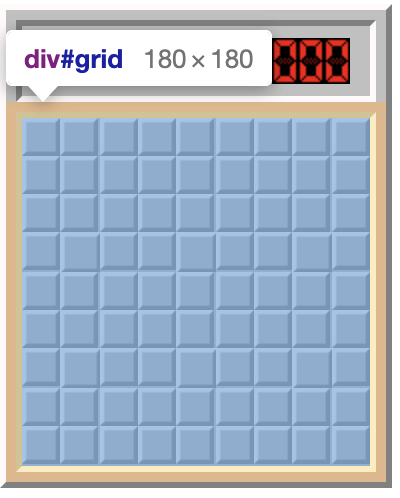
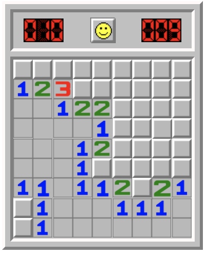
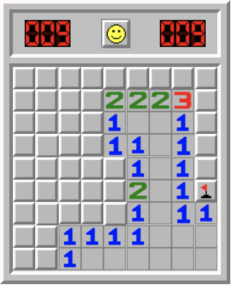
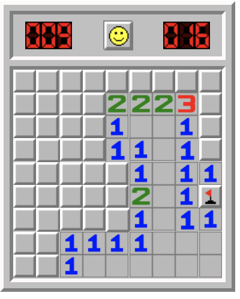

	
	
### Software Engineering Immersive

# Project 1 - Minesweeper

## Overview

This was my first solo development project, as part of my education with GA's Software Engineering Immersive bootcamp.

The task was to build a grid-based game, rendered in-browser with HTML/CSS and programmed using vanilla JavaScript.

I chose to re-create Windows 98 Minesweeper, as it is a game I am very familar with from my formative years, and it represented the sort of challenge I wanted to face at this early stage of my development career.

You can play my game here! ***[Classic Minesweeper](https://raspanda.github.io/GA-project1/)***

### Minesweeper Intro, Controls & Mechanics

[Minesweeper Wikipedia page](https://en.wikipedia.org/wiki/Minesweeper_(video_game))

Minesweeper is a classic single-player puzzle game, originating from the 1960's, which came pre-installed on many OSs. 

The general idea of the game involves trying to figure out the locations of a set number of mines in a grid, and "mark" them. The game provides numbered clues as the player makes progress. 

The game ends as a player win once all mines are (correctly) marked, or as a loss if the player marks an incorrect cell, or reveals a mine.

- The player can use a left-click to reveal a specific cell, in order to reveal it and make progress through the grid.
- The player will receive informaton, through numbers in revealed cells. These number denote how many mines are in neighbouring, uncovered, cells.
- If the player reveals a cell with no mines in neighbouring cells, those cells will automatically be revealed in a chain-reaction.
- A right-click is essential in order to perform the "mark" mechanic, where the player attempts to identify the suspected locations of the hidden mines.
- Finally, there is a key mechanic of the Windows 98 version of the game (and later versions), using a combined left+right click. When the player performs this combination-click on an already revealed cell, they will reveal neighbouring, non-revealed cells (if those neighbours do not contain any mines). However if the player attempts to use this mechanic, and there are mines in the neighbouring cells, nothing will happen.
-  Importantly, if the player attempts to use the combination-click mechanic, and there are incorrect flags or "marks" in the neighbouring cells which are being detected, this is an automatic fail and the game ends. This mechanic both provides more clues to the player, and adds an element of skill to the game in order to use it correctly.

### The Brief

- Render a game in-browser
- Design logic for winning & losing
- Include separate HTML / CSS / JavaScript files
- Stick with KISS (Keep It Simple Stupid) and DRY (Don't Repeat Yourself) principles
- Use Javascript for DOM manipulation
- Deploy your game online, where the rest of the world can access it
- Use best practices when developing in HTML where appropriate (semantic tags etc.)

### Technologies used

- HTML5 & CSS3
- JavaScript (ES6)
- Git & GitHub
- Adobe Photoshop

## Approach

In terms of programming, there were a few key areas of focus

1. Storing information
2. Setting up the game (grid area & mine locations)
3. Detecting cell locations
4. Cell-reveal mechanics (recursion)
5. Left-click & right-click functionality (simpler) & Middle-click functionality (more complicated)
6. UI functionality (Timer, mines counter, scoreboard)

### 1. Storing information

Core to this game, is building a series of data structures (e.g. grid-structure, mine locations, which cells are revealed/flagged, etc.). These structures would need to be accessed whenever required, in order for them to "communicate" with each other, so as to produce the games' mechanics (e.g. cell reveals)

Due to the more robust nature of arrays in JavaScript (i.e. will retain strict ordering), as well as the diverse array (pun not intended!) of methods available, these were used for all data-storing. All globally-scoped arrays were set up previous to to the main programming:

```Javascript
//! Arrays

let cellsArr = [] // Provides grid structure
let minesArr = [] // Stores mines
let flaggedArr = [] // Stores player-flagged cells
let clearedArr = [] // Stores cleared cells
let winningArr = [] // Stores flagged cells + cleared cells, required to trigger win condition
```

### 2. Setting up the game

I opted to dynamically create the game grid programatically using JavaScript. The grid gets created using input variables for the width & height, which can be changed to create larger grids for higher difficulties. Each cell is assigned an ID number, which is subsequently stored in the main structure-array.

```Javascript
function createGrid() {
  for (let index = 0; index < width * height; index++) {
    // ? Generate each element + push to data array
    const cell = document.createElement('div')
    setupGrid.appendChild(cell)
    cellsArr.push(cell)
    // ? Number each cell by its index
    cell.setAttribute('id', index)
    // ? Set the width and height of grid
    if (width <= 16) {
      setupGrid.style.width = `${20 * width}px`
      setupGrid.style.height = `${20 * height}px`
      cell.style.width = `${100 / width}%`
      cell.style.height = `${100 / height}%`
    } else {
      setupGrid.style.width = `${20 * width}px`
      setupGrid.style.height = '320px'
      cell.style.width = `${100 / width}%`
      cell.style.height = `${100 / height}%`
    }
    // ? Render cells correctly
    cell.setAttribute('class', 'facingDown')
  }
}
```
Completed Grid:




Mines were then set-up and locations randomised:

```Javascript
function setMines() {
  // ? Push the number of mines ('true') to the array
  for (let index = 0; index < minesToSet; index++) {
    minesArr.push(true)
  }
  // ? Fill the rest of the array with empty cells ('false'), equal to the length of the grid array
  for (let index = 0; index < (cellsArr.length - minesToSet); index++) {
    minesArr.push(false)
  }
  // ? Randomise locations of mines
  minesArr.sort(() => 0.5 - Math.random())
}
```

All other arrays were set up in the same way as the mines array, but filling them with false values only.

### 3. Detecting cell locations

Being able to detect a cell's specific location was a key hurdle to overcome early in the project, as this information was key for styling, and the cell revealing mechanic. 

In order to address this challenge, I wrote a key function which was called several times throughout the program:

```Javascript
function createNeighboursArr(cellId) {
  // ? Top left cell
  if (cellId === 0) {
    return [1, parseInt(width), (width + 1)]
  // ? Top right cell
  } else if (cellId === width - 1) {
    return [(width - 2), (width * 2 - 2), (width * 2 - 1)]
  // ? Bottom right cell
  } else if (cellId === width * height - 1) {
    return [(width * height - 2), (width * height - width - 2), (width * height - width - 1)]
  // ? Bottom left cell
  } else if (cellId === width * height - width) {
    return [(width * height - width + 1), (width * height - width * 2), (width * height - width * 2 + 1)]
  // ? Rest of top row
  } else if (cellId < width) {
    return [(cellId - 1), (cellId + 1), (cellId + width - 1), (cellId + width), (cellId + width + 1)]
  // ? Rest of right column
  } else if (cellId % width === 0) {
    return [(cellId - width), (cellId - width + 1), (cellId + 1), (cellId + width), (cellId + width + 1)]
  // ? Rest of bottom row
  } else if ((cellId + width) >= width * height) {
    return [(cellId - width - 1), (cellId - width), (cellId - width + 1), (cellId - 1), (cellId + 1)]
  // ? Rest of left column
  } else if (cellId % width === width - 1) {
    return [(cellId - width - 1), (cellId - width), (cellId - 1), (cellId + width - 1), (cellId + width)]
  // All other cells (middle)
  } else {
    return [(cellId - width - 1), (cellId - width), (cellId - width + 1), (cellId - 1), (cellId + 1), (cellId + width - 1), (cellId + width), (cellId + width + 1)]
  }
}
```
This program returned a temporary array with the IDs of the neighbours of a specific cell, using the width and height of the grid to provide this information.

### 4. Cell reveal mechanic (recursion)

Many would consider this the key challenge of making this game! In order to solve this, I first created a function which provides the number of mines in a specific cells' neighbours:

```Javascript
function countNeighbours(neighbourArr) {
  const numOfMinesArr = []
  for (let index = 0; index < neighbourArr.length; index++) {
    numOfMinesArr.push(minesArr[neighbourArr[index]])
  }
  return numOfMinesArr.filter(x => x).length
}
```

This function then retuns that value as an integer to the below key function, with the recursive element:

```Javascript
function revealCell(cellId) {
  // ? Create neighbours array
  const neighbours = createNeighboursArr(cellId)
  // ? Get number of mines in neighbours
  const numOfMinesInNeighbours = countNeighbours(neighbours)
  // ? If the target cell is already revealed, do nothing
  if (clearedArr[cellId] === true) {
    return
  // ? If the target cell is flagged, do nothing
  } else {
    if (flaggedArr[cellId] === true) {
      return
    // ? If the target cell has a mine, end the game
    } else if (minesArr[cellId] === true) {
      endGame(cellId)
    // ? If the target cell's neighbours have no mines, call this function again in all the neighbours (after rendering and storing information)
    } else if (numOfMinesInNeighbours === 0) {
      if (clearedArr[cellId] === false) {
        cellsArr[cellId].classList.add('_0')
        clearedArr[cellId] = true
        winningArr[cellId] = true
        for (let index = 0; index < neighbours.length; index++) {
          revealCell(neighbours[index])
        }
      }
    // ? Finish the recursion, by labelling the cells with the correct numbers and store the necessary information
    } else {
      cellsArr[cellId].classList.remove('facingDown')
      cellsArr[cellId].classList.add(`_${numOfMinesInNeighbours}`)
      clearedArr[cellId] = true
      winningArr[cellId] = true
    }
  }
}
```
E.g. if the player clicks the bottom right corner cell, a chain reaction triggers which reveals a large section of the grid:



### 5. Left-click & right-click (simpler) & Middle-click functionality (more complicated)

This was unexpectedly a much bigger challenge to overcome, due to the solution for the middle-click functionality being quite complicated. Not only for the programmatic aspect, but the styling aspect as well.

Firstly, I needed to use 'mousedown' & 'mouseup' event listeners, instead of 'click'. This was to add more complex functionality to these specific events, but also to toggle two variables to read whether the left or right mouse buttons were being clicked.

Then I was able to build the following logic on the larger event listener functions:

```Javascript
//? Set up button toggles
let leftButton = false
let rightButton = false

function createEventListeners() {
  cellsArr.forEach((cell) => {
  //? On mouse down
    cell.addEventListener('mousedown', (event) => {
      //? If cell is not revealed
      if (clearedArr[(parseInt(event.currentTarget.id))] === false) {
        //? If cell is flagged, do nothing
        if (flaggedArr[(parseInt(event.currentTarget.id))] === true && event.button === 0) {
          return
        //? If cell is not flagged, move through the options
        //? If it is a right click, flag cell
        } else if (flaggedArr[(parseInt(event.currentTarget.id))] === true && event.button === 2) {
          flagCell((parseInt(event.currentTarget.id)))
        //? If it is a left click, toggle left button variable and trigger styling
        } else if (event.button === 0 && rightButton === false) {
          leftButton = true
          mouseDownCovered((parseInt(event.currentTarget.id)))
          smileyButton.classList.remove('smiley')
          smileyButton.classList.add('smileyooh')
        //? If it is a right click and held, flag cell and toggle variable
        } else if (event.button === 2 && leftButton === false) {
          rightButton = true
          flagCell((parseInt(event.currentTarget.id)))
        //? If both buttons are pressed, trigger styling
        } else if (event.button === 2 && leftButton === true) {
          rightButton = true
          mouseDownDoubleCovered((parseInt(event.currentTarget.id)))
          smileyButton.classList.remove('smiley')
          smileyButton.classList.add('smileyooh')
        }
        //? If cell is revealed
      } else if (clearedArr[(parseInt(event.currentTarget.id))] === true) {
        //? Left button styling & toggle
        if (event.button === 0 && rightButton === false) {
          leftButton = true
          smileyButton.classList.remove('smiley')
          smileyButton.classList.add('smileyooh')
        //? Right button toggle
        } else if (event.button === 2 && leftButton === false) {
          rightButton = true
        //? If both buttons clicked, trigger styling and toggling
        } else if ((event.button === 2 && leftButton === true) || (event.button === 0 && rightButton === true)) {
          leftButton = true
          rightButton = true
          mouseDownDoubleRevealed((parseInt(event.currentTarget.id)))
          smileyButton.classList.remove('smiley')
          smileyButton.classList.add('smileyooh')
        }
      }
    })
  })
  cellsArr.forEach((cell) => {
  //? On mouse up
    cell.addEventListener('mouseup', (event) => {
      //? If cell is not revealed
      if (clearedArr[(parseInt(event.currentTarget.id))] === false) {
      //? Left button only - Trigger styling & toggle
        if (event.button === 0 && leftButton === true && rightButton === true) {
          leftButton = false
          rightButton = false
          mouseUpCovered((parseInt(event.currentTarget.id)))
          mouseUpDoubleCovered((parseInt(event.currentTarget.id)))
          smileyButton.classList.remove('smileyooh')
          smileyButton.classList.add('smiley')
        //? If right button up while left is down - Trigger styling & toggle
        } else if (event.button === 2 && leftButton === true && rightButton === true) {
          leftButton = false
          rightButton = false
          mouseUpCovered((parseInt(event.currentTarget.id)))
          mouseUpDoubleCovered((parseInt(event.currentTarget.id)))
          smileyButton.classList.remove('smileyooh')
          smileyButton.classList.add('smiley')
        //? Right button only - Trigger styling & toggle
        } else if (event.button === 2) {
          rightButton = false
        //? Left button up - Trigger reveal mechanic on specific cell
        } else if (event.button === 0 && leftButton !== false) {
          leftButton = false
          revealCell((parseInt(event.currentTarget.id)))
          smileyButton.classList.remove('smileyooh')
          smileyButton.classList.add('smiley')
        }

        //? If cell is revealed
      } else if (clearedArr[(parseInt(event.currentTarget.id))] === true) {
        //? If both buttons up - (Key "middle-click" mechanic below) First, trigger styling
        if (leftButton === true && rightButton === true) {
          leftButton = false
          rightButton = false
          mouseUpDoubleRevealed((parseInt(event.currentTarget.id)))
          smileyButton.classList.remove('smileyooh')
          smileyButton.classList.add('smiley')

          //? Create array of neighbours which are covered
          const neighbours = createNeighboursArr((parseInt(event.currentTarget.id)))
          const coveredNeighbours = []
          for (let index = 0; index < neighbours.length; index++) {
            if (clearedArr[neighbours[index]] === false) {
              coveredNeighbours.push(neighbours[index])
            }
          }

          //? create array of neighbours wtih/withoout mines + arrays of neighbours with/without flags
          const coveredNeighboursWithMines = []
          const coveredNeighboursNoMines = []
          const coveredNeighboursWithFlags = []
          const coveredNeighboursWithMinesAndFlags = []

          for (let index = 0; index < coveredNeighbours.length; index++) {
            if (minesArr[coveredNeighbours[index]] === true) {
              coveredNeighboursWithMines.push(coveredNeighbours[index])
            }
            if (minesArr[coveredNeighbours[index]] === false) {
              coveredNeighboursNoMines.push(coveredNeighbours[index])
            }
            if (flaggedArr[coveredNeighbours[index]] === true) {
              coveredNeighboursWithFlags.push(coveredNeighbours[index])
            }
            if (flaggedArr[coveredNeighbours[index]] === true && minesArr[coveredNeighbours[index]] === true) {
              coveredNeighboursWithMinesAndFlags.push(coveredNeighbours[index])
            }
          }

          //? Check if there are any wrong flags. If yes, end game.
          if (coveredNeighboursWithMines.length > 0 && coveredNeighboursWithFlags.length > 0 && coveredNeighboursWithMinesAndFlags.toString() !== coveredNeighboursWithFlags.toString()) {
            for (let index = 0; index < coveredNeighboursWithMines.length; index++) {
              cellsArr[coveredNeighboursWithMines[index]].classList.add('minedead')
            }
            endGame(coveredNeighboursWithFlags[0])
            //? If all flags are correct, and there are no mines in the covered neighbours, reveal neighbours.
          } else if (coveredNeighboursNoMines.length > 0 && coveredNeighboursWithMinesAndFlags.toString() === coveredNeighboursWithMines.toString() && coveredNeighboursWithMinesAndFlags.toString() === coveredNeighboursWithFlags.toString()) {
            for (let index = 0; index < coveredNeighboursNoMines.length; index++) {
              revealCell(coveredNeighboursNoMines[index])
            }
          }
        //? Single clicks up - Toggles
        } else if (event.button === 0) {
          leftButton = false
        } else if (event.button === 2) {
          rightButton = false
        }
      }
```
The key "middle-click" mechanic code was more complicated as it required very specific arrays to be created, with very specific conditions. Without these specific arrays, styling and triggering would occur on the wrong cells (e.g. already revealed cells). 

Example: In the below situation, the player assumes there is a mine in the cell to the right, and flags it:



Then, after flagging, the player can middle-click on the cell directly to the left of the flagged cell, and the cell above gets revealed due to it being empty.



### 6. UI functionality (Timer, mines counter, scoreboard)

A basic timer was programmed and styled using a setInterval which was triggered on the players' initial click. The timer would stop when the game is won or lost. In the event of the game being won, the timer value would be passed as the players highscore on the scoreboard.


The mines counter is an important feature which tracks the number of flags the player has made. Once the value is at 0, the program will check whether the "winning" array exactly matches the "mines" array. If this condition returns true, the winning function gets run.

The styling programming of the clock and mines are nestled into various other functions.


### Other considerations

- endGame function: This function triggers on the various loss scenarios. The function loops through the mines array and applies styling to the grid array, in order to reveal all the mines.
- Smiley button: The smiley button at the top of the grid serves as the reset button. Clicking this button resets all arrays and re-runs the setUpGame function which re-creates all arrays.
- Mouseover, mouseout, mouseleave: Other event listeners for these events were programmed for styling purposes.
- Setting difficulties: A simple dropdown + button was added above the game in order to create larger grids with more mines. These values were passed as variables into the setUpGame function to amend the grid creation.

## Known bugs

- Not a bug, but small rendering issues persist due to low resolution images used for the cell styling.
- If the player reveals a mine as their first cell, the clock interval starts but doesn't stop.
- If the player combination-clicks at the start of the game, but doesn't reveal any cells, the clock will start.

## Potential future features

- Server-side storage for scoreboard
- Responsive design for different screen sizes
- Mobile-compatibility
- Touchpad compatibility

## Conclusions

This was a true learning experience, and the list of specific things learned would be very long!

Overall, I reall enjoyed building an all-time-favourite game of mine. I gained a much deeper understanding of web developemnt, and I also drastically improved my debugging skills. It also provided a valuable lesson on planning, and how crucial the process of whiteboarding, notetaking, and mapping is to web development.
Finally this project has fundamentally shifted my mindset when it comes to approaching web development, and given me the confidence to be able to meet future projects head on!

I hope you do enjoy the game!

## Credit goes to...

Thank you to [Emmett Nicholas](http://emmettnicholas.com/), whose own [Windows 98 minesweeper clone](http://minesweeperonline.com/) was a big help (as well as a source of image assets!).
Also thanks to [Pär Dahlman](https://github.com/pardahlman) who I sources other assets from.
